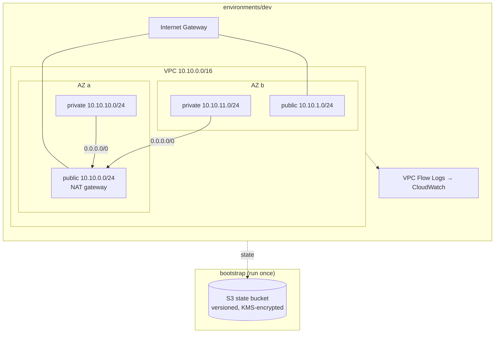

# aws-terraform-infra

[](https://github.com/ZarthVazer/aws-terraform-infra/actions/workflows/terraform.yml)


Modular AWS infrastructure written in Terraform: secure remote state, a reusable multi-AZ VPC module and separate environments, checked on every change by formatting, validation, linting and a security scan.

> 🚧 **Work in progress.** Built step by step, like a real platform team would:
> - [x] Remote state backend (S3 + KMS + native locking)
> - [x] VPC module and `dev` environment
> - [x] CI: fmt, validate, tflint, Trivy
> - [ ] EKS module (managed node groups, IRSA)
> - [ ] `prod` environment with highly available NAT
> - [ ] `terraform plan` in pull requests via GitHub OIDC (no static AWS keys)

## Architecture



## Repository layout

```
.
├── bootstrap/              # S3 bucket + KMS key for remote state (local state, run once)
├── modules/
│   └── vpc/                # reusable VPC module (see its README)
├── environments/
│   └── dev/                # dev environment: wires modules together, own state file
├── .github/workflows/      # CI: fmt, validate, tflint, Trivy
├── .tflint.hcl             # lint rules incl. AWS ruleset
└── .trivyignore            # accepted security findings, each with a reason
```

**Modules** describe *how* to build something; **environments** decide *what* to build and with which settings. Each environment has its own state file, so a mistake in `dev` cannot touch `prod`.

## Getting started

Requirements: Terraform ≥ 1.11, AWS CLI configured with credentials (`aws configure`).

```bash
# 1. Create the state bucket (once per AWS account)
cd bootstrap
cp terraform.tfvars.example terraform.tfvars   # set a globally unique bucket name
terraform init && terraform apply

# 2. Put that bucket name into environments/dev/backend.tf, then:
cd ../environments/dev
terraform init
terraform plan
terraform apply
```

Or with the Makefile: `make plan ENV=dev`, `make apply ENV=dev`.

> 💰 **Cost note:** the NAT gateway is billed hourly (roughly $30–40/month plus traffic in most regions). Run `terraform destroy` in `environments/dev` when you are done experimenting. The state bucket itself costs cents.

## Design decisions

**Remote state with S3-native locking.** State lives in a versioned, KMS-encrypted bucket that rejects non-TLS requests and blocks all public access. Locking uses `use_lockfile` (Terraform ≥ 1.11) instead of a separate DynamoDB table — one resource less to manage. `prevent_destroy` protects the bucket from an accidental `terraform destroy`.

**Own VPC module instead of a community one.** The public `terraform-aws-modules/vpc` is excellent, but writing the module shows exactly which resources a VPC needs and keeps it small enough to read in five minutes.

**Cost-aware NAT.** `single_nat_gateway = true` in dev saves money; prod will use one NAT per AZ so losing an AZ doesn't cut outbound traffic for the others. Private route tables are already per-AZ, so switching is a one-line change.

**Secure defaults.** Public subnets don't auto-assign public IPs, the default security group has no rules, VPC flow logs are on, and the flow-log IAM role can only write to its own log group.

**Ready for EKS.** Subnets carry the `kubernetes.io/role/elb` and `internal-elb` tags, so the AWS Load Balancer Controller will find them without extra configuration.

**Security findings are explicit.** Trivy fails the build on HIGH/CRITICAL issues. The two LOW findings that are accepted are listed in `.trivyignore` together with the reason, instead of being silently disabled.

## CI

| Job | What it checks |
|---|---|
| Format | `terraform fmt -check` across the repo |
| Validate | `init -backend=false` + `validate` for every stack and module |
| TFLint | best practices + AWS-specific rules (invalid instance types, naming, docs) |
| Security scan | Trivy IaC scan; results also appear in the GitHub *Security* tab |

CI needs no AWS credentials: everything runs without touching a real account.

## License

MIT
